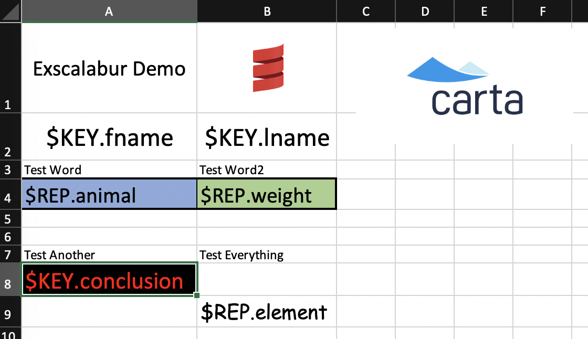
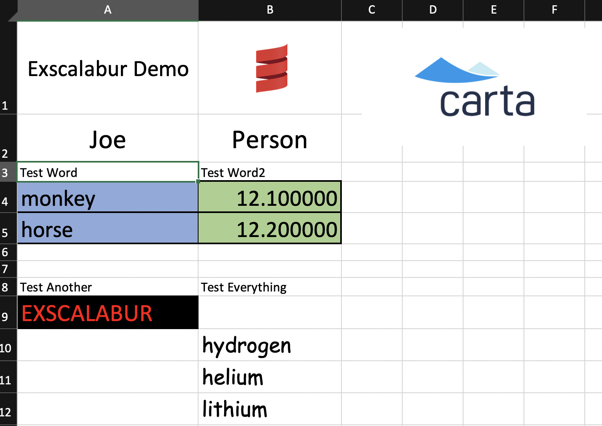

[](https://circleci.com/gh/carta/exscalabur/tree/master)
[](https://www.scala-lang.org/download/2.12.8.html)
[](https://cloudsmith.io/~carta/repos/maven-releases/packages/detail/maven/exscalabur_2.12/latest/xg=com.carta/)

# Exscalabur

A Scala library for creating excel files from data and a template.

## Usage

Add it as a dependency:
`libraryDependencies += "com.carta" % "exscalabur" % "2.12.8"`

## Development

### Requirements

- Java 11 or later
- Scala 2.12 or later
- [sbt](https://www.scala-sbt.org/1.x/docs/Setup.html) 1.2.8 or higher

### Common sbt Commands

| Command     | Description                                          |
| ----------- | ---------------------------------------------------- |
| `~compile`  | `~` enables hot reloading                            |
| `~run`      | `~` enables hot reloading                            |
| `test`      | Runs all tests                                       |
| `testQuick` | Runs tests only affected by your latest code changes |
| `clean`     | Removes generated files from the target directory    |
| `update`    | Updates external dependencies                        |
| `package`   | Creates JAR                                          |
| `publishLocal` | Publishes to local IVY repository, by default in `~/.ivy2/local` |

## How To Use

## Templates
To use Exscalabur to create Excel files, you first require an __Excel Template__ file. 

The Excel template contains formatting and layout but instead of data, there will be __keys__ in the cells where your data will be located. 

Any cell styling/cell borders must be made to the template.

An example of what a template sheet may look like:



## Template Keys
A template key is a cell with the value `$KEY.` or `$REP.` prefixed.
A `$KEY.` cell will be substituted for a single piece of data.
A `$REP.` cell will be substituted multiple times, creating a new row for each piece of data given.

Cells that do not contain keys will be copied as is.

In the above example, this template has 6 keys:`$KEY.fname`, `$KEY.lname`, `$REP.animal`, `$REP.weight`, `$KEY.conclusion`,and `$REP.element`.

## Schema Definition
### Yaml
A schema definition is required, and may be provided as a YAML file with the below structure:

```yaml
KEYNAME1:
  dataType: oneOf("string", "double", "long")
  excelType: oneOf("string", "number", "date")
KEYNAME2:
  dataType: oneOf("string", "double", "long")
  excelType: oneOf("string", "number", "date")  
# etc
```

`KEYNAME` is the **key** exactly as seen in the template. 
`excelType` is the type of the cell in the final sheet.
`dataType` is the runtime type of the data to be substituted.

A `YamlReader` class is provided to convert the yaml file into an in-code representation. 

The `YamlReader` can be imported from `com.carta.yaml.YamlReader`

For the above template Excel file, the following may be an example of the `schema` definition:

```yaml
$KEY.fname:
  columnType: "string"
  excelType: "string"

$KEY.lname:
  columnType: "string"
  excelType: "string"

$KEY.conclusion:
  columnType: "string"
  excelType: "string"

$REP.animal:
  columnType: "string"
  excelType: "string"

$REP.weight:
  columnType: "double"
  excelType: "double"
  
$REP.element:
  columnType: "string"
  excelType: "string"
```

### In-Code Map
Alternatively, this **schema** may be provided in-code as a `Map[String, YamlEntry]`.
The Map's keys are the `KEYNAME`s.
`YamlEntry` is a provided case class representing the above YAML structure.  

`YamlEntry` can be imported using: `import com.carta.yaml.YamlEntry`

## Data Substitution

### Single-Substitution Data

To pass data in to be substituted into a `$KEY.` template cell, an instance of a `DataCell(key: String, value: oneOf(String, Long, Double))` must be created.
`key` is the __key__ from the template, __without the `$KEY.` prefix__.
`value` is the value to substitute. It's runtime type must match the schema definition.

For example, in the above example, we may have `DataCell`s like:

```Scala
import com.carta.exscalabur.DataCell

DataCell("fname", "Joe");
DataCell("lname", "Person")
DataCell("conclusion", "EXSCALABUR")
```

### Repeated Data Substitution
To pass data to be substituted into a repeated row, instances of `DataRow` are passed in, containing `DataCell`s for each cell in the repeated row.

For the example, our `DataRow` instances might look like:

```scala
import com.carta.exscalabur.DataRow

DataRow().addCell("animal", "monkey").addCell("weight", 12.1)
DataRow().addCell("animal", "horse").addCell("weight", 12.2)
DataRow().addCell("element", "hydrogen")
DataRow().addCell("element", "helium")
DataRow().addCell("element", "lithium")
```

## Writing

Exscalabur supports multi-step writes. This can be done with multiple calls to `writeStaticData` and `writeRepeatedData`.

Currently, Exscalabur only supports writing in an append-only manner. So, for the above example, the data for `$KEY.fname` must be provided before the data for $REP.animal is provided.

There are plans for Exscalabur to support writing to rows out of order, but this has yet to be implemented.

__Exscalabur does not support sub-tables arranged horizontally__

Lastly, all that's left is to write the data. To do so, create an instance of a `Exscalabur` object:

```scala
import com.carta.exscalabur.Exscalabur

Exscalabur(
  templates, // Iterable[String], representing paths to the template sheets
  schema, // The in-code schema representation explained above
  windowSize // number of rows in the output workbook to keep in memory at a time
)
```

For every sheet to be written to, create a `SheetWriter`:

```scala
exscalabur.getAppendOnlySheetWriter(sheetName) // sheetName is as defined in the template sheet.
```
Note, the `sheetName` used here comes from the tab in the template. It __must match the template exactly__

Write static data: `sheetWriter.writeStaticData(staticData: Seq[DataCell])`

and to write repeated data: `sheetWriter.writeRepeatedData(repeatedData: Seq[DataRow])`

And write to the output file: `exscalabur.exportToFile(outputPath)`

Doing so results in the final output sheet:

